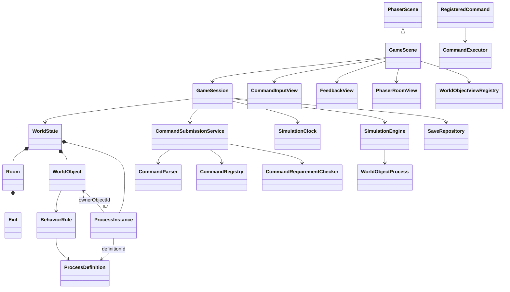

# Game Architecture

## Scope

This document describes the command-driven RTS game architecture and its first playable room. The repository uses Vite, TypeScript, and Phaser 4.2.1.

## Architectural decisions

- One `GameScene` owns the Phaser runtime scene. The bottom command input and all game feedback are presented inside the game view.
- The game uses a 1920×1080 scene size and Phaser `FIT` scaling, centered in the browser viewport. It preserves the full scene at every viewport ratio and fills any unused area with a dark background; it does not enter browser fullscreen mode.
- The game world is a TypeScript domain model. Phaser objects render that model but are not the authoritative world state.
- Directory and file terminology is a command-facing metaphor. A virtual path resolves to a `Room` or `WorldObject`; the game does not model entities as operating-system files and never invokes the host shell.
- Only registered virtual command executors are executable. The grammar accepts one command per submitted line; pipes, chained commands, and player-written scripts are outside this foundation.
- A submitted command runs synchronously and updates world state or object intent. Autonomous world behavior advances separately in fixed simulation ticks, while the input remains available.
- `ProcessDefinition` and `ProcessInstance` are separate concepts. A world object can have zero or more running instances, and behavior rules can select a definition based on conditions.
- `TickSimulationEngine` accumulates elapsed game time into 100 ms ticks, visits world objects in stable array order, and runs each matching behavior process once per tick.
- Persistence is behind a repository interface and targets browser-local storage. A save snapshot includes world state and raw command history. The trigger and cadence for saving are outside this architecture decision.

## Runtime responsibilities

### Phaser scene

`GameScene` extends `Phaser.Scene` and uses a 1920×1080 reference coordinate space. Phaser scales that complete scene proportionally to fit the browser viewport and centers it over a dark background when the viewport has a different aspect ratio. It creates the Room 1 world, session, room and object views, input, feedback, and outcome panels, then forwards Phaser's frame delta to the session. It does not contain command rules or world-object process logic. `createGame` starts with `GameScene`; a future start screen can become the first scene in the scene list.

`PhaserCommandInputView` is mounted at the bottom center of `GameScene`. It accepts printable English ASCII, edits with the supported cursor keys, wraps at a fixed character count, and scrolls to keep the cursor visible. Enter submits the complete input string and clears the field. `PhaserRoomView` projects room and World Object state to Phaser images; `PhaserGameOutcomePanel` presents Game Over and Congratulations states.

### Application session

`GameSession` coordinates the current `WorldState`, command submission, and simulation. A submitted raw string is added to command history and passed to command submission immediately. The simulation advances from the scene update loop through `SimulationClock` and `SimulationEngine`.

### Command submission

The synchronous submission pipeline is:

1. `VirtualCommandParser` parses one input line into a command name, options, and arguments.
2. `RegisteredCommandRegistry` resolves the command name against the implemented allow-list.
3. `CommandRequirementChecker` checks the selected command's requirements against the current command and world state.
4. If the requirements pass, the registered command's `CommandExecutor` updates domain state.
5. `CommandResult` returns success feedback or a failure reason to the in-game feedback view.

Syntax parsing, allow-list lookup, requirement checking, and execution are separate responsibilities. `ls` marks discoverable objects in the current Room as discovered; the view reveals them from world state. `cd <room>` resolves an Exit and sets the Player Character's action and destination; room paths accept an optional trailing slash, and tab completion displays exits with one. Requirement failures are returned to the UI with their reason. Feedback uses a required variant: object-attached feedback has a target object ID; general feedback has no object target. The game event that creates feedback selects the variant.

### World and process model

`WorldState` is the source of truth for rooms, world objects, active process instances, the current room, simulation tick, game outcome, and raw command history. `Room` is the game's independently enterable area and owns its Exits. `WorldObject` is a domain entity with identity, room ownership, metadata, behavior rules, and runtime state. Its metadata can contain information that player commands do not reveal.

`BehaviorRule` connects a world object to a condition and a `ProcessDefinition`. On each simulation tick, `TickSimulationEngine` evaluates those rules and invokes the registered logic for each matching definition. A `ProcessInstance` stores runtime state for the owner object and process definition. The relationship is represented by IDs; neither processes nor world objects are represented as files.

`VirtualWorldPathResolver` maps command-facing virtual paths to room or object IDs through the `WorldPathResolver` contract. It does not access the host filesystem.

### Simulation time

`RealtimeSimulationClock` converts Phaser's frame delta into game delta. `TickSimulationEngine` accumulates that delta and runs fixed 100 ms ticks, so object behavior does not depend on the browser's render frame rate. Future commands that pause or change speed should control the clock through the command layer rather than reaching into Phaser's frame loop.

### First room behavior

Room 1 starts with the Player Character in the upper-left, a hidden Dagger in the lower-left, and a hidden Guard on the right. The room's right-side Exit leads to Room 2. `ls` discovers the dagger and guard. `cd room2/` gives the Player Character a travel goal; its process chooses a direct route if the objects have not been discovered, or collects and equips the dagger before luring the guard if they have.

The Guard process starts pursuit while the Player Character is in the room's right half and stops moving when the Player Character leaves it. An unarmed player caught by the guard ends the game. With the dagger equipped, the player can retreat, attack the guard from the left side, and then reach the exit. Entering Room 2 sets the Congratulations outcome.

### Persistence

`WorldStateCodec` converts between live domain classes and the serializable `WorldStateSnapshot`. `SaveSnapshot` also carries raw command history. `SaveRepository` hides the storage mechanism; `LocalStorageSaveRepository` is the browser-local adapter. Phaser Game Objects, active keyboard focus, and other presentation details are reconstructed or restored separately. The architecture does not choose when snapshots are captured.

## Class relationships



`PhaserScene` in the diagram means `Phaser.Scene`. Services collaborate through composition and interfaces rather than a deep class tree. World-object process logic operates on serializable domain state, not Phaser Game Objects.

## Source layout

```text
CONTEXT.md
docs/
  architecture.md
  adr/
    0001-phaser-independent-world-state.md
    0002-virtual-allowlisted-commands.md
    0003-fit-full-scene-to-viewport.md
    0004-world-objects-act-on-simulation-ticks.md
src/
  main.ts
  game/
    createGame.ts
    application/
      GameSession.ts
    content/
      createRoom1Session.ts
      room1.ts
      room1Commands.ts
    scenes/
      GameScene.ts
    domain/
      BasicWorldObject.ts
      ids.ts
      JsonValue.ts
      Room.ts
      WorldObject.ts
      WorldObjectState.ts
      WorldPath.ts
      WorldPathResolver.ts
      VirtualWorldPathResolver.ts
      WorldState.ts
    processes/
      BehaviorRule.ts
      ProcessDefinition.ts
      ProcessInstance.ts
    commands/
      ParsedCommand.ts
      CommandHistory.ts
      CommandFeedback.ts
      CommandResult.ts
      CommandRequirement.ts
      CommandParser.ts
      CommandRegistry.ts
      CommandRequirementChecker.ts
      EveryCommandRequirementChecker.ts
      RegisteredCommandRegistry.ts
      VirtualCommandParser.ts
      CommandSubmissionService.ts
      executors/
        base.ts
        cd.ts
        ls.ts
    simulation/
      SimulationClock.ts
      SimulationEngine.ts
      RealtimeSimulationClock.ts
      TickSimulationEngine.ts
      room1/
        Room1Processes.ts
    persistence/
      SaveSnapshot.ts
      SaveRepository.ts
      LocalStorageSaveRepository.ts
      WorldStateCodec.ts
      JsonWorldStateCodec.ts
    presentation/
      CommandInputView.ts
      PhaserCommandInputView.ts
      FeedbackView.ts
      PhaserFeedbackView.ts
      PhaserRoomView.ts
      PhaserGameOutcomePanel.ts
      WorldObjectViewRegistry.ts
  assets/
    game/
      fonts/
        PressStart2P-Regular.ttf
        OFL.txt
      ui/
        textbox.png
      characters/
        player/idle.png
        guard/idle.png
      items/
        weapons/dagger.png
```

The Press Start 2P font, distressed textbox frame, monochrome character art, and dagger image form the initial presentation assets.

## Framework references

- [Phaser Scene API](https://docs.phaser.io/api-documentation/4.0.0/class/scene) — the Phaser scene base class and scene lifecycle.
- [MDN: `localStorage`](https://developer.mozilla.org/en-US/docs/Web/API/Window/localStorage) — browser storage that persists across browser sessions.
